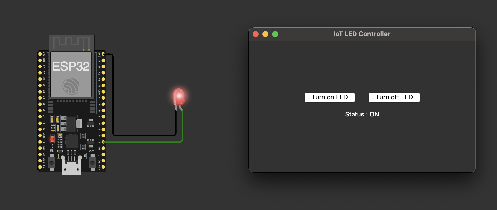
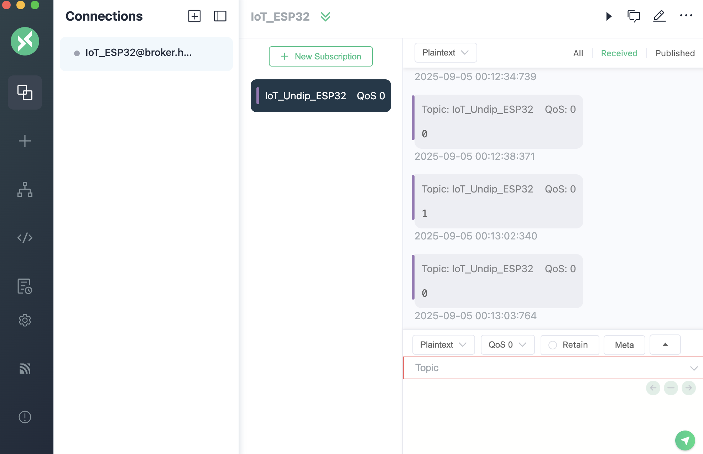

# IoT ESP32 Project

This project demonstrates controlling an **ESP32** over MQTT using a **Python GUI** built with Tkinter.  
It uses **Wokwi** as the ESP32 simulator and **PlatformIO** in VS Code for development.    

**HiveMQ** : Broker 
**MQTTX** : MQTT Client tool (see incoming payload)

---

## Features
- ESP32 connects to **HiveMQ public MQTT broker** (`broker.hivemq.com`)
- Subscribes to topic `IoT_Undip_ESP32`
- Turns onboard LED **ON** or **OFF** depending on MQTT message
- Python Tkinter GUI with buttons to:
  - Turn LED **ON**
  - Turn LED **OFF**
  - Show current LED status
- Simulated in **Wokwi** for quick testing

### ESP32 - GUI

### MQTTX

---
